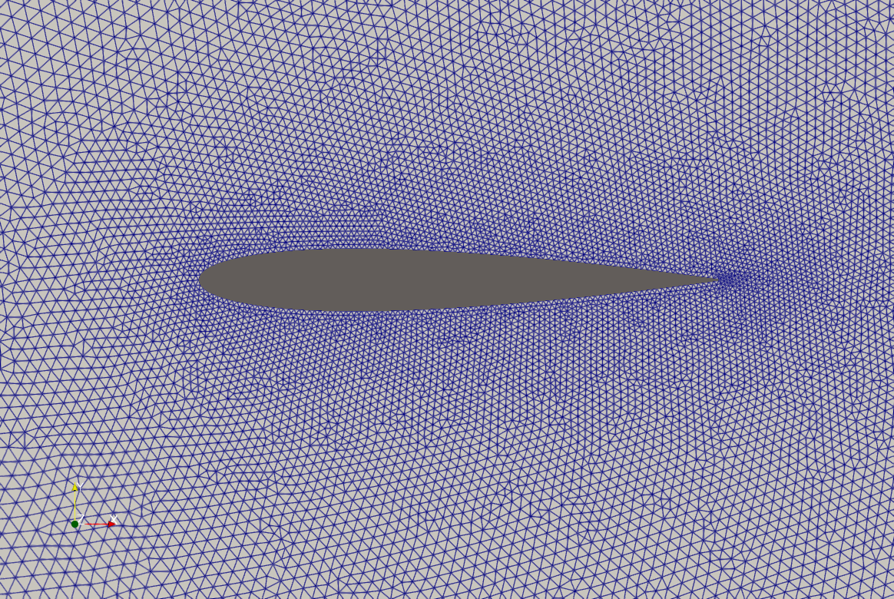
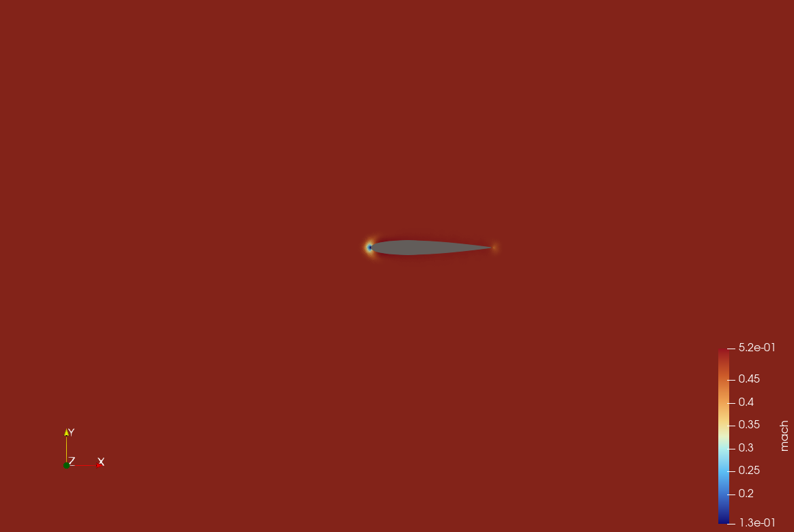
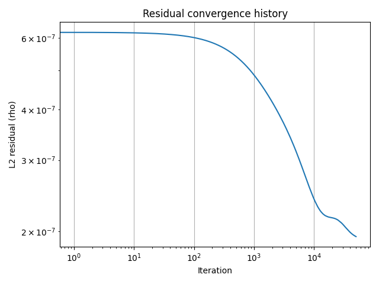

# 2D Euler CFD Solver (Prototype)

## 📌 Overview

This project is a **2D finite volume solver for compressible Euler
equations** on unstructured triangular meshes.

It is developed as a **personal prototype** to better understand and
implement: - Numerical methods for CFD - Unstructured mesh handling -
Flux-based finite volume schemes

> ⚠️ This is a **prototype / research-oriented code**, not a
> production-ready solver.

------------------------------------------------------------------------

## ✨ Features

-   Finite Volume Method (cell-centered)
-   Unstructured triangular mesh (Gmsh)
-   Euler equations (compressible flow)
-   Rusanov (local Lax-Friedrichs) flux
-   Local time stepping (CFL-based)
-   Explicit pseudo-time integration
-   Boundary conditions:
    -   Slip wall (Euler wall)
    -   Farfield (Rusanov-based, freestream state)
-   Residual monitoring (L2, relative, Linf)
-   VTK output (ParaView visualization)

------------------------------------------------------------------------

## 🧮 Governing Equations

The solver uses the **2D compressible Euler equations** in conservative
form:

    W = [ rho, rho*u, rho*v, rho*E ]

### Pressure relation

(%5Crho%20E%20-%200.5%5Crho(u%5E2%2Bv%5E2)))

### Flux projected along a normal

%20%5Ccdot%20n%20%3D%20%5Cbegin%7Bpmatrix%7D%20%5Crho%20u_n%20%5C%5C%20%5Crho%20u%20u_n%20%2B%20p%20n_x%20%5C%5C%20%5Crho%20v%20u_n%20%2B%20p%20n_y%20%5C%5C%20(%5Crho%20E%20%2B%20p)%20u_n%20%5Cend%7Bpmatrix%7D)

------------------------------------------------------------------------

## 🔢 Numerical Method

### Finite Volume formulation

    W_i^{n+1} = W_i^n - (dt_i / |Omega_i|) * sum(F_faces)

### Numerical flux (Rusanov)

%20-%200.5%20s_%7Bmax%7D%20(W_R%20-%20W_L))

-   Robust and stable
-   Introduces numerical diffusion

------------------------------------------------------------------------

## 🌊 Boundary Conditions

### Wall (slip condition)

-   No mass flux
-   No energy flux
-   Only pressure contribution


------------------------------------------------------------------------

### Farfield (current implementation)

The farfield boundary is implemented using a **Rusanov flux with
freestream state**:

    F_bc = F_rusanov(W_inside, W_inf)

-   Simple and robust
-   Does not use characteristic decomposition
-   Slightly diffusive

> ⚠️ A characteristic-based boundary condition would improve convergence
> behavior.

------------------------------------------------------------------------

## 🧱 Mesh Handling

-   Mesh generated with **Gmsh**
-   Read from `.msh` (v4.1 format)
-   Internal storage optimized for performance:
    -   `CoordX`, `CoordY`, `CoordZ`
    -   Triangle connectivity
    -   Face reconstruction
-   Face data:
    -   Normals
    -   Surface
    -   Left/right cells

------------------------------------------------------------------------

## ▶️ How to Run

### 1. Generate mesh

``` bash
cd mesh_generation/script
g++ naca0012.cpp -o naca0012 -lgmsh
./naca0012
```

### 2. Build solver

``` bash
mkdir build && cd build
cmake ..
make
```

### 3. Run simulation

``` bash
./solver
```

------------------------------------------------------------------------

## 📊 Output

-   `.vtk` files (ParaView)
-   Residual history file

Typical fields: - Density - Pressure - Velocity - Mach number

------------------------------------------------------------------------

## 📈 Example Results (Minf = 0.5, CFL = 0.001)

### Mesh

<p align="center">
  
</p>


### Solution (Mach number)

<p align="center">
  
</p>

### Residual history

<p align="center">
  
</p>

------------------------------------------------------------------------

## ⚠️ Numerical Behavior

-   Residuals decrease initially
-   A minimum is reached
-   Then a slight increase appears

This is typical for: - First-order scheme - Rusanov flux (diffusive) -
Simplified farfield BC


------------------------------------------------------------------------

## ⚠️ Limitations

-   First-order scheme (no MUSCL)
-   Diffusive flux (Rusanov)
-   Simplified farfield boundary
-   No viscous terms (Euler only)
-   Explicit solver only (no implicit yet)
-   No parallelization

------------------------------------------------------------------------

## 🚀 Future Improvements

-   MUSCL reconstruction (2nd order)
-   Roe / HLLC flux
-   Characteristic farfield BC
-   Implicit solver
-   Mesh adaptation (goal-oriented :eyes:)
-   MPI parallelization

------------------------------------------------------------------------

## 👨‍🔬 Author

Kevin Ancourt\
PhD in Computational Fluid Dynamics

Specialized in: - Adjoint methods - Goal-oriented mesh adaptation -
High-performance scientific computing

------------------------------------------------------------------------

## 📜 License

This project is released for **educational and research purposes**.
